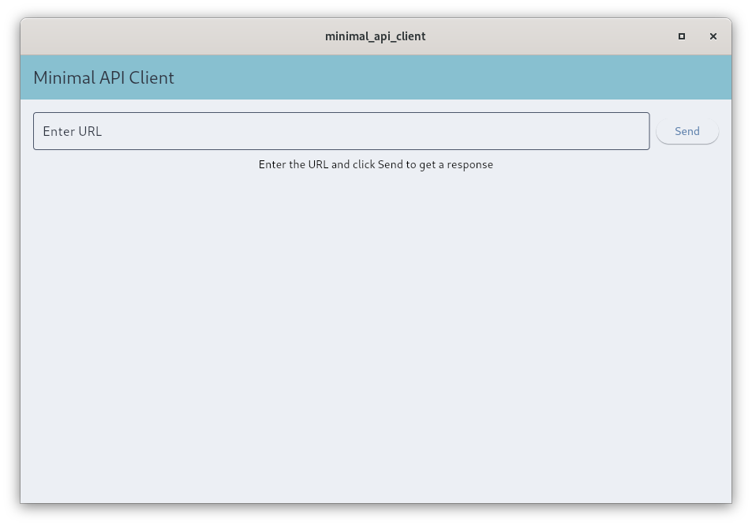
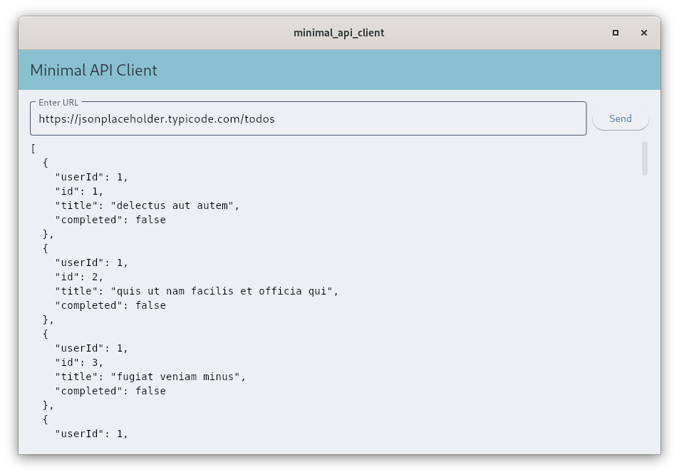

# Minimal API Client

A lightweight Flutter desktop app for developers and testers to make HTTP GET requests and view formatted JSON responses—ideal for quickly inspecting endpoints and simplifying API debugging during development.

## Technologies Used

- Flutter / Dart
- [http](https://pub.dev/packages/http) – for performing API calls
- [provider](https://pub.dev/packages/provider) – MVVM architecture and state management

## Running the App

**Requirements:** Flutter SDK installed

To run the app on desktop:

```bash
flutter run -d windows   # Or macos/linux depending on your OS
```

## Screenshots

<p align="center">
  
  
</p>

## Upcoming Changes

- Add support for POST, PUT, PATCH, and DELETE methods
- Add request headers and body input
- Show response headers
- Improve error handling and validation
